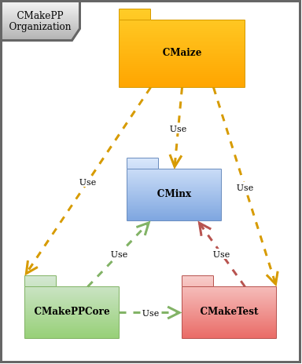

The CMakePP (a backronym for CMake Packaging Project) organization aims to
simplify building and packaging complex C++ projects using CMake. To do this the
CMakePP organization has built up a series of projects that together form a
CMake development ecosystem.

## CMakePackagingProject

- [GitHub](https://github.com/CMakePP/CMakePackagingProject)
- [Documentation](https://cmakepackagingproject.readthedocs.io/en/latest/)

The top-level user API for writing a build system using CMakePP. If you are
interested in building a project that uses CMakePP or if you want to use CMakePP
as your build system this is the project to consider.

## CMakePPCore

- [GitHub](https://github.com/CMakePP/CMakePPCore)
- [Documentation](https://cmakeppcore.readthedocs.io/en/latest/)

Maybe you don't care for the CMakePP user-APIs or you want to design your own.
We highly recommend using the object-oriented CMakePP language for such
endeavors. CMakePPCore implements the CMakePP language.

## CMakeTest

- [GitHub](https://github.com/CMakePP/CMakeTest)
- [Documentation](https://cmaketest.readthedocs.io/en/latest/)

A unit-testing framework for code written using CMake/CMakePP languages

## CMakeDoc

- [GitHub](https://github.com/CMakePP/CMakeDoc)
- [Documentation](https://cmakedoc.readthedocs.io/en/latest/)

A tool, a la Doxygen, for generating reStructuredText documentation for APIs of
CMake/CMakePP functions

## CMakeDev

- [GitHub](https://github.com/CMakePP/CMakeDev)
- [Documentation](https://cmakedev.readthedocs.io/en/latest/)

Developers manual for the CMakePP project. A useful community resource for
others wanting to write their own CMake modules.
